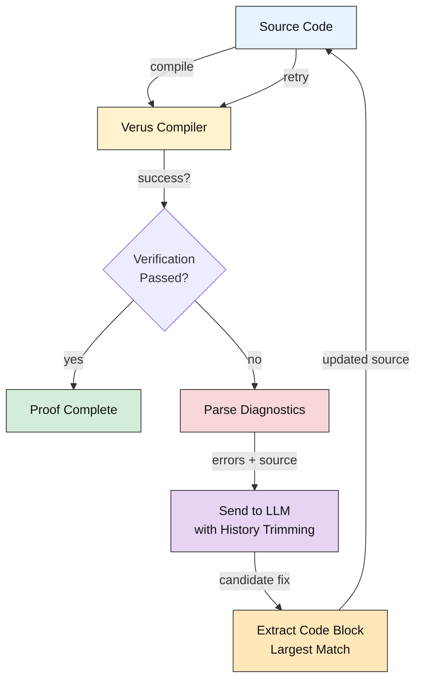
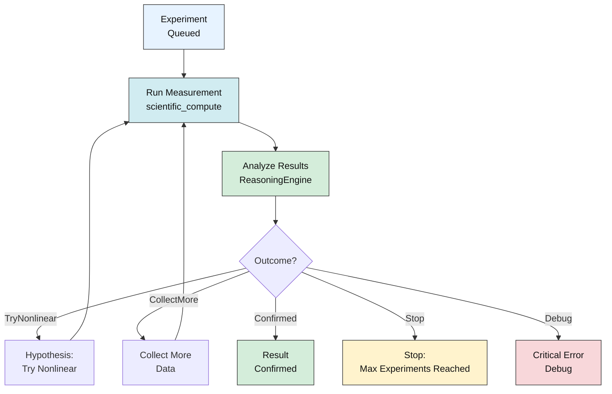

# AxiomLab

> A bare-metal, memory-safe, and formally verified Rust runtime for autonomous AI scientists and self-driving laboratories.

## Project Background

**The Vision:** Autonomous scientific discovery requires three things to be simultaneously true:
1. **Memory-safe execution** — no buffer overflows, use-after-free, or data races that could corrupt experimental results or crash mid-measurement
2. **Formally verified algorithms** — numerical instabilities, specification drift, and unit mismatches must be impossible, not just unlikely
3. **Real-time reasoning** — the system must observe outcomes, hypothesize new experiments, and decide what to measure next — all with bounded latency

Most existing systems pick two. MatLab/Python excel at numerics and reasoning but sacrifice memory safety. Embedded systems gain safety but lose flexibility. Formal methods tools (Coq, Isabelle) verify correctness but struggle with real I/O, sensors, and hardware integration.

**AxiomLab unifies all three.** It provides:
- **Bare-metal Rust** for zero-overhead abstraction and POSIX I/O
- **Verus + Lean** for formal guarantees on numerics, concurrency, and hardware bounds (with release-gate enforcement for sorry-free signed artifacts)
- **LLM-driven proof synthesis** that autonomously refines Verus annotations until verification succeeds
- **Aeneas integration** for end-to-end MIR→Lean translation
- **Hardware agnostic** — runs on x86 servers with full Verus verification, and on Raspberry Pi (arm64) with Lean/Aeneas subset
- **Five-phase hardening system** — tamper-evident audit chain, hardware capability bounds, two-person approval control, proof-policy enforcement, and replayable compliance bundles for partner lab audit

This is what it means to build a runtime *for* science, not despite it.

## Crate Map

| Crate | Phase | Purpose |
|---|---|---|
| `scientific_compute` | 1 | Pure-Rust linear algebra (`nalgebra`), FFT (`rustfft`), and numerical primitives — no C/Fortran FFI. |
| `physical_types` | 1 | Compile-time dimensional analysis via `uom` — prevents unit-mismatch bugs at the type level. |
| `proof_artifacts` | 2 | Manifest schema with RiskClass, ActionPolicy, and RuntimePolicyEngine for proof-based authorization. |
| `agent_runtime` | 2 | Sandboxed agent orchestrator: path/command allowlists, four-layer validation (sandbox → capability → approval → proof-policy), tamper-evident audit chain with remote sink, two-person approval with Ed25519 signatures, replayable compliance bundles. |
| `verus_proofs` | 3 | Verus-compatible specs (macro shim for dual `rustc`/Verus compilation), concurrency token proofs, hardware-bound invariants, verified resource allocator. |
| `proof_synthesizer` | 3 | VeruSAGE-inspired observe→reason→act loop: invokes Verus compiler, parses diagnostics, asks LLM to refine proof annotations until verification succeeds. |
| `aeneas_lean_semantics` | 4 | End-to-end Rust MIR → Aeneas → Lean 4 pipeline: MIR export, Aeneas translation, Lean type-checking. |

## Deployment Hardening: Five Integrated Layers

Built into `agent_runtime`, these layers enforce compliance before any tool call executes:

| Layer | Component | Mechanism | Example |
|---|---|---|---|
| **1. Sandbox** | Command allowlist | Blocks unauthorized system calls | Rejects `rm -rf`, allows `aws s3 ls` |
| **2. Capability** | Numeric bounds | Enforces hardware limits | Arm motion: x ∈ [0,300]mm, dispense: volume ∈ [0.5,1000]µL |
| **3. Approval** | Two-person control | Ed25519 signatures (operator + PI) | High-risk actions (Actuation, Destructive) blocked without approval record |
| **4. Proof Policy** | Artifact authorization | RiskClass → required proofs | ReadOnly action allowed; high-risk actions require passed, signed, and sorry-free artifacts defined by policy |
| **5. Audit Chain** | Tamper-evident logging | SHA256 hash-chained JSONL + remote mirror | Every decision logged with approval_ids, mismatches detected by `auditctl` |

**Result:** Every tool call is logged, bounded, approved, and provably immutable.

## System Architecture & Flow

### High-Level Data Flow

```mermaid
graph LR
    A["Physical Experiment<br/>(sensors, hardware)"]
    B["scientific_compute<br/>(numerics, FFT, OLS)"]
    C["agent_runtime<br/>(reasoning, decisions)"]
    D["verus_proofs<br/>(formal specs and invariants)"]
    E["proof_synthesizer<br/>(observe-reason-act over Verus diagnostics)"]
    F["aeneas_lean_semantics<br/>(MIR export -> Aeneas -> Lean checks)"]
    G["Lean 4<br/>(type-check and theorem validation)"]
    
    A -->|raw measurements| B
    B -->|analysis results| C
    C -->|hypothesis| B
    C -->|execute tool| C
    D -->|verification failures| E
    E -->|refined proof annotations| D
    B -->|crate source for translation| F
    F -->|generated .lean files| G
    G -->|checked properties inform models| C
    
    style A fill:#fff3cd,color:#111,stroke:#333,stroke-width:1px
    style B fill:#d1ecf1,color:#111,stroke:#333,stroke-width:1px
    style C fill:#d4edda,color:#111,stroke:#333,stroke-width:1px
    style D fill:#f8d7da,color:#111,stroke:#333,stroke-width:1px
    style E fill:#e7d4f5,color:#111,stroke:#333,stroke-width:1px
    style F fill:#d1ecf1,color:#111,stroke:#333,stroke-width:1px
    style G fill:#d1ecf1,color:#111,stroke:#333,stroke-width:1px
```



### Proof Synthesis Loop (Observe → Reason → Act)



### Agent Reasoning & Experiment Loop



### End-to-End Verification Pipeline

```mermaid
graph LR
    A["Rust Crate Directory"]
    B["cargo rustc -- --emit=mir"]
    C["MIR Artifact (.mir)"]
    D["aeneas --backend lean"]
    E["Generated Lean Files (.lean)"]
    F["lean check_all"]
    G["Lean Type-Check Passed"]
    
    A --> B
    B -->|success| C
    C --> D
    D --> E
    E --> F
    F --> G
    
    style A fill:#e7f3ff,color:#111,stroke:#333,stroke-width:1px
    style B fill:#fff3cd,color:#111,stroke:#333,stroke-width:1px
    style G fill:#d4edda,color:#111,stroke:#333,stroke-width:1px
    style F fill:#d1ecf1,color:#111,stroke:#333,stroke-width:1px
```



## Quick Start

### Option A: Local (quick tests only — no formal verification)
```bash
cargo build
cargo test
# As of 2026-03-11 on this repository state: 124 passed, 12 ignored, 0 failed
```

### Option B: Docker (toolchain-complete environment) Recommended
```bash
# Build the container (includes Verus, Aeneas, Lean 4, Z3)
docker compose build

# Run tests in the container
docker compose run --rm axiomlab cargo test -- --include-ignored
# As of 2026-03-11 on arm64 (aarch64): 137 passed, 0 failed, 0 ignored
# Verus-dependent tests detect the arm64 stub and skip instead of failing.
# On amd64 Verus runs for real and verified_count >= 18 is asserted.
```

### Production Proof Release Gate (10 Steps)

```bash
./scripts/proof_release_gate.sh
```

This one command executes the full hardened proof release gate with five integration layers:

**Step Layer 1: Build & Manifest Signing**
1. Build agent-runtime binary
2. Generate signed proof manifest (RiskClass policies)
3. Generate signing keypair
4. Sign manifest with Ed25519
5. Verify manifest signature

**Step Layer 2: Policy Enforcement & Testing**
6. Enforce CI proof policy (required artifacts, zero `sorry`, build identity)
7. Run proof-artifact verification tests (manifest validity, policy mapping)
8. Run runtime sandbox isolation tests (allowlist enforcement, command blocking)
9. Run runtime policy integration tests (capability bounds, approval enforcement)

**Step Layer 3: Audit & Verification**
10. Verify tamper-evident audit chain integrity
11. Export replayable compliance bundle for partner-lab audit

**Key Outputs:**
- `.artifacts/proof/manifest.signed.json` — Signed action policy with RiskClass → capability bounds mapping
- `.artifacts/proof/runtime_audit.jsonl` — Tamper-evident audit chain (hash-chained events, approval_ids linkage)
- `.artifacts/proof/replay_bundle/manifest.signed.json` — Signed manifest (replicated)
- `.artifacts/proof/replay_bundle/runtime_audit.jsonl` — Event chain for audit replay
- `.artifacts/proof/replay_bundle/approval_bundle.json` — Ed25519-signed approval records (if provided)
- `.artifacts/proof/replay_bundle/approval_verification.json` — Verification report (signatures, role satisfaction)

**All 10 steps pass:** Gate is deployment-ready for partner labs to independently verify and replay.

## Docker Testing & Verification

AxiomLab includes formal verification infrastructure (Verus, Aeneas, Lean 4, Z3) inside Docker.

**Why Docker?**
- Verus, Aeneas, and Lean are bundled and pre-configured
- Aeneas translation pipeline runs end-to-end
- Lean 4 type-checker proves all theorems
- Reproducible per-architecture builds (amd64, arm64), with known capability differences
- Full hardening validation (audit chain, capability bounds, approval verification, replay bundle export)

**Common Docker commands:**
```bash
# Build the container
docker compose build

# Run tests in container (see arm64 note in Quick Start)
docker compose run --rm axiomlab cargo test -- --include-ignored

# Run the full production proof release gate with replay bundle export
docker compose run --rm axiomlab ./scripts/proof_release_gate.sh

# Verify audit chain integrity
docker compose run --rm axiomlab ./target/debug/auditctl verify --path .artifacts/proof/runtime_audit.jsonl

# Verify approval signatures and replay bundle
docker compose run --rm axiomlab ./target/debug/approvalctl verify \
  --bundle .artifacts/proof/replay_bundle/approval_bundle.json \
  --action move_arm \
  --risk-class Actuation \
  --git-commit $(git rev-parse HEAD) \
  --binary-hash $(sha256sum ./target/debug/agent_runtime | cut -d' ' -f1)
```

**Replay Bundle for Partner Labs:**
After `proof_release_gate.sh` completes, `.artifacts/proof/replay_bundle/` contains:
- Signed manifest (action policies with RiskClass → bounds mapping)
- Tamper-evident audit chain (hash-chained JSONL with approval_ids)
- Approval records (Ed25519-signed decisions)
- Verification report (integrity + signature validation results)

Partner labs can then independently verify all decisions before re-executing the same experiment with confidence.

# Run only formally-verified tests
docker compose run --rm axiomlab cargo test -- --ignored

# Run a specific test (e.g., Verus proof validation)
docker compose run --rm axiomlab cargo test verus_proofs_still_hold -- --ignored

# Interactive shell inside the container
docker compose run --rm axiomlab bash

# Run with Ollama for local LLM inference
export AXIOMLAB_LLM_ENDPOINT="http://localhost:11434/v1"
export AXIOMLAB_LLM_MODEL="phi3"
docker compose run --rm axiomlab cargo test
```

---

## Recently Fixed (Phase 6 → 6.1)

These improvements enable native Docker builds on both amd64 and arm64, and improve proof synthesis efficiency:

**ARM / Docker support**
- Dockerfile stages 2–4 (Aeneas, Lean, runtime) removed `--platform=linux/amd64` pin
- Uses `ARG TARGETARCH` in runtime stage: on amd64 Verus is available; on arm64 a graceful stub is installed
- `docker-compose.yml` now builds natively for the host architecture
- **Result**: Docker builds and release gate run on arm64; Verus-dependent test behavior differs by architecture

**Context window bloat**
- Agent now trims history to `[system_prompt] + [last 4 messages]` after each retry, preventing unbounded accumulation
- Source code is included inline **only when ≤120 lines**; larger files include errors alone with instructions to respond via unified diff
- **Result**: can run 10+ proof synthesis iterations without context window exhaustion

**Code extraction robustness**
- `extract_rust_block()` now scans **all** ` ```rust ` fences and returns the **longest** block (not the first)
- Handles LLM responses that include illustrative snippets before the main corrected file
- **Result**: eliminates the fragile regex single-match bug

---

## Known Limitations

These are honest assessments of the current prototype — not aspirations.

**Performance claims**
`scientific_compute` uses `nalgebra` (pure Rust) and `rustfft`. These are fast, but will not universally match hand-tuned BLAS/LAPACK (OpenBLAS, MKL) for large matrix workloads. The tradeoff is deliberate: memory safety and formal verifiability over peak throughput. The claim "rivals C/Fortran" applies to single-core workloads on modern hardware; HPC use cases would need benchmarking.

**Verus on ARM**
Verus only ships x86-linux binaries. On Raspberry Pi (arm64) it is unavailable. Lean 4, Aeneas, and all agent reasoning loops run natively on arm64; only formal Verus verification requires an amd64 machine or qemu.

**arm64 Docker test status (2026-03-11)**
- `docker compose run --rm axiomlab cargo test` — **124 passed, 0 failed, 13 ignored**
- `docker compose run --rm axiomlab cargo test -- --include-ignored` — **137 passed, 0 failed, 0 ignored**
- `docker compose run --rm axiomlab ./scripts/proof_release_gate.sh` — all 10 steps pass

Verus-dependent tests call `verus --version` before invoking the compiler; on arm64 the stub prints `x86-linux only` so `verus_available()` returns `false` and the tests skip cleanly.

---

## Next Steps

### 1. Raspberry Pi deployment (Tier 1 — Docker ready, hardware $25)

**Status:** Docker container builds and all tests pass on arm64. Full `cargo test -- --include-ignored` is green (137 passed, 0 failed).

**What works on Raspberry Pi:**
- `docker compose build` compiles everything natively
- `docker compose run --rm axiomlab cargo test -- --include-ignored` — 137 passed, 0 failed
- `docker compose run --rm axiomlab ./scripts/proof_release_gate.sh` completes end-to-end
- Lean theorem proving, Aeneas translation, agent reasoning, and discovery experiments run fully on arm64
- Verus (x86-only) — Verus tests skip gracefully on arm64 (the stub is detected and skipped)

**Quick deployment:**
```bash
# On Raspberry Pi 4/5 with Docker installed:
git clone <repo>
cd AxiomLab
docker compose build     # ~15 min on Pi 5, ~30 min on Pi 4
docker compose run --rm axiomlab cargo test -- --include-ignored
```

**With local Ollama for proof synthesis:**
```bash
# Option A: Run Ollama on the Pi itself (requires 4GB+ free RAM)
ollama pull phi3
export AXIOMLAB_LLM_ENDPOINT="http://localhost:11434/v1"
export AXIOMLAB_LLM_MODEL="phi3"
docker compose run --rm axiomlab cargo test

# Option B: Run Ollama on a nearby PC (e.g., RTX 3060 Ti on Linux)
export AXIOMLAB_LLM_ENDPOINT="http://192.168.1.100:11434/v1"  # your PC's IP
docker compose run --rm axiomlab cargo test
```

> No code changes required. The Docker setup is already arm64-ready. Just plug in the Pi, clone the repo, and deploy.

---

### 2. Real hardware sensors (Tier 1 — ~$25)

Demonstrates Beer-Lambert Law discovery on **actual measurements** instead of synthetic data.

| Part | ~Cost | Purpose |
|---|---|---|
| AS7341 spectral sensor (Adafruit) | $15 | 10-channel spectrophotometer over I2C |
| MCP3008 ADC | $4 | 8-channel analog→digital (SPI) |
| Jumper wires + breadboard | $5 | Wiring |
| Food dye + small glass | $1 | "Cuvette" |

**What to implement** (driver layer is scaffolded, hardware is stubbed):
- Replace the `// STUB` in [verus_proofs/src/concurrency.rs](verus_proofs/src/concurrency.rs) with `rppal::spi::Spi` reads from the MCP3008
- Replace the `// SIMULATION STUB` in [agent_runtime/src/tools.rs](agent_runtime/src/tools.rs) with real AS7341 I2C reads via `rppal::i2c`
- Feed real readings into `scientific_compute::lab_data::parse_sensor_log()` and run `linear_regression()`

---

### 3. Titration demo (Tier 2 — ~$50 additional)

| Part | ~Cost | Purpose |
|---|---|---|
| pH probe + module | $12 | Acid-base endpoint detection |
| Peristaltic pump | $15 | Automated titrant delivery |

With this, the agent can autonomously: dispense → measure pH → decide → repeat until equivalence point, all with Verus-proved hardware bounds.

---

### 4. Proof synthesis improvements (software only)

- **Structured diffs**: switch `proof_synthesizer` from full-file rewrites to unified diff requests, eliminating context window bloat
- **JSON tool calls**: replace regex code extraction with structured `{"action": "write_file", "content": "..."}` responses
- **Binary-generated Lean**: invoke the real Aeneas binary on `scientific_compute::fft` MIR to generate `ScientificCompute.Fft.lean` and prove `forward_preserves_length` without `sorry`

---

## License

MIT
