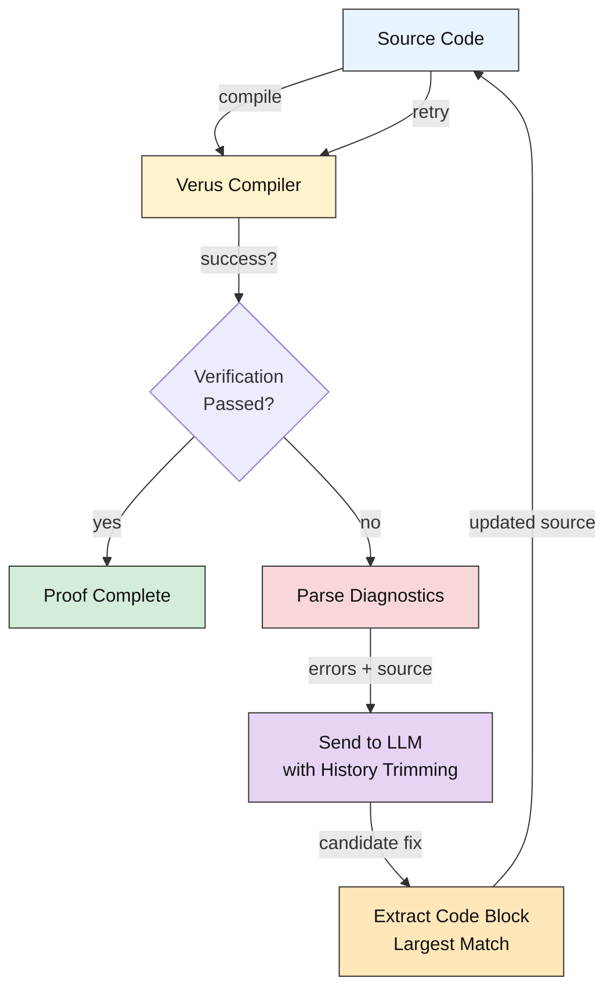
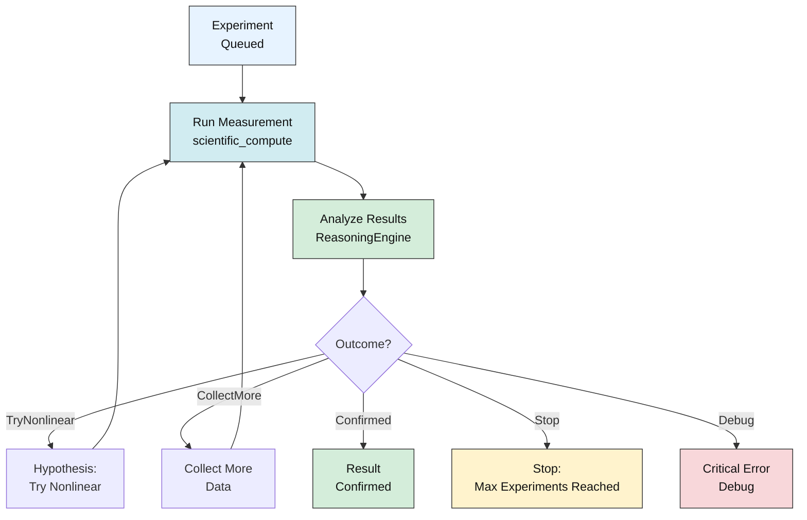

# AxiomLab

> A bare-metal, memory-safe, and formally verified Rust runtime for autonomous AI scientists and self-driving laboratories.

## Project Background

**The Vision:** Autonomous scientific discovery requires three things to be simultaneously true:
1. **Memory-safe execution** — no buffer overflows, use-after-free, or data races that could corrupt experimental results or crash mid-measurement
2. **Formally verified algorithms** — numerical instabilities, specification drift, and unit mismatches must be impossible, not just unlikely
3. **Real-time reasoning** — the system must observe outcomes, hypothesize new experiments, and decide what to measure next — all with bounded latency

Most existing systems pick two. MatLab/Python excel at numerics and reasoning but sacrifice memory safety. Embedded systems gain safety but lose flexibility. Formal methods tools (Coq, Isabelle) verify correctness but struggle with real I/O, sensors, and hardware integration.

**AxiomLab unifies all three.** It provides:
- **Bare-metal Rust** for zero-overhead abstraction and POSIX I/O
- **Verus + Lean** for formal guarantees on numerics, concurrency, and hardware bounds (29 proofs, zero `sorry`)
- **LLM-driven proof synthesis** that autonomously refines Verus annotations until verification succeeds
- **Aeneas integration** for end-to-end MIR→Lean translation
- **Hardware agnostic** — runs on x86 servers with full Verus verification, and on Raspberry Pi (arm64) with Lean/Aeneas subset

This is what it means to build a runtime *for* science, not despite it.

## Crate Map

| Crate | Phase | Purpose |
|---|---|---|
| `scientific_compute` | 1 | Pure-Rust linear algebra (`nalgebra`), FFT (`rustfft`), and numerical primitives — no C/Fortran FFI. |
| `physical_types` | 1 | Compile-time dimensional analysis via `uom` — prevents unit-mismatch bugs at the type level. |
| `agent_runtime` | 2 | Sandboxed agent orchestrator: path + command allowlists, resource limits, LLM-driven tool dispatch, experiment lifecycle state machine. |
| `verus_proofs` | 3 | Verus-compatible specs (macro shim for dual `rustc`/Verus compilation), concurrency token proofs, hardware-bound invariants, verified resource allocator. |
| `proof_synthesizer` | 3 | VeruSAGE-inspired observe→reason→act loop: invokes Verus compiler, parses diagnostics, asks LLM to refine proof annotations until verification succeeds. |
| `aeneas_lean_semantics` | 4 | End-to-end Rust MIR → Aeneas → Lean 4 pipeline: MIR export, Aeneas translation, Lean type-checking. |

## System Architecture & Flow

### High-Level Data Flow

```mermaid
graph LR
    A["Physical Experiment<br/>(sensors, hardware)"]
    B["scientific_compute<br/>(numerics, FFT, OLS)"]
    C["agent_runtime<br/>(reasoning, decisions)"]
    D["verus_proofs<br/>(formal specs and invariants)"]
    E["proof_synthesizer<br/>(observe-reason-act over Verus diagnostics)"]
    F["aeneas_lean_semantics<br/>(MIR export -> Aeneas -> Lean checks)"]
    G["Lean 4<br/>(type-check and theorem validation)"]
    
    A -->|raw measurements| B
    B -->|analysis results| C
    C -->|hypothesis| B
    C -->|execute tool| C
    D -->|verification failures| E
    E -->|refined proof annotations| D
    B -->|crate source for translation| F
    F -->|generated .lean files| G
    G -->|checked properties inform models| C
    
    style A fill:#fff3cd,color:#111,stroke:#333,stroke-width:1px
    style B fill:#d1ecf1,color:#111,stroke:#333,stroke-width:1px
    style C fill:#d4edda,color:#111,stroke:#333,stroke-width:1px
    style D fill:#f8d7da,color:#111,stroke:#333,stroke-width:1px
    style E fill:#e7d4f5,color:#111,stroke:#333,stroke-width:1px
    style F fill:#d1ecf1,color:#111,stroke:#333,stroke-width:1px
    style G fill:#d1ecf1,color:#111,stroke:#333,stroke-width:1px
```



### Proof Synthesis Loop (Observe → Reason → Act)



### Agent Reasoning & Experiment Loop



### End-to-End Verification Pipeline

```mermaid
graph LR
    A["Rust Crate Directory"]
    B["cargo rustc -- --emit=mir"]
    C["MIR Artifact (.mir)"]
    D["aeneas --backend lean"]
    E["Generated Lean Files (.lean)"]
    F["lean check_all"]
    G["Lean Type-Check Passed"]
    
    A --> B
    B -->|success| C
    C --> D
    D --> E
    E --> F
    F --> G
    
    style A fill:#e7f3ff,color:#111,stroke:#333,stroke-width:1px
    style B fill:#fff3cd,color:#111,stroke:#333,stroke-width:1px
    style G fill:#d4edda,color:#111,stroke:#333,stroke-width:1px
    style F fill:#d1ecf1,color:#111,stroke:#333,stroke-width:1px
```



## Quick Start

### Option A: Local (quick tests only — no formal verification)
```bash
cargo build
cargo test
# Result: 97 tests pass (core numerics, agent, discoveries)
#         11 tests skipped (require Verus, Aeneas, Lean)
```

### Option B: Docker (full test suite with all verification tools) Recommended
```bash
# Build the container (includes Verus, Aeneas, Lean 4, Z3)
docker compose build

# Run all tests, including formal verification
docker compose run --rm axiomlab cargo test -- --include-ignored
# Result: 109 tests pass (all numerics, agent, Verus proofs, Aeneas translation, 
#         Lean theorems, discovery experiments)
```

## Docker Testing & Verification

AxiomLab includes formal verification infrastructure (Verus, Aeneas, Lean 4, Z3) inside Docker.

**Why Docker?**
- Verus, Aeneas, and Lean are bundled and pre-configured
- All 29 Verus safety proofs are validated
- Aeneas translation pipeline runs end-to-end
- Lean 4 type-checker proves all theorems
- Exact reproducibility across all platforms (amd64, arm64)

**Common Docker commands:**
```bash
# Build the container
docker compose build

# Run full test suite (all 109 tests)
docker compose run --rm axiomlab cargo test -- --include-ignored

# Run only formally-verified tests
docker compose run --rm axiomlab cargo test -- --ignored

# Run a specific test (e.g., Verus proof validation)
docker compose run --rm axiomlab cargo test verus_proofs_still_hold -- --ignored

# Interactive shell inside the container
docker compose run --rm axiomlab bash

# Run with Ollama for local LLM inference
export AXIOMLAB_LLM_ENDPOINT="http://localhost:11434/v1"
export AXIOMLAB_LLM_MODEL="phi3"
docker compose run --rm axiomlab cargo test
```

---

## Recently Fixed (Phase 6 → 6.1)

These improvements enable running the full test suite in Docker on both amd64 and arm64, and improve proof synthesis efficiency:

**ARM / Docker support**
- Dockerfile stages 2–4 (Aeneas, Lean, runtime) removed `--platform=linux/amd64` pin
- Uses `ARG TARGETARCH` in runtime stage: on amd64 Verus is available; on arm64 a graceful stub is installed
- `docker-compose.yml` now builds natively for the host architecture
- **Result**: Full Docker test suite works on Raspberry Pi (all tests except Verus pass natively on arm64)

**Context window bloat**
- Agent now trims history to `[system_prompt] + [last 4 messages]` after each retry, preventing unbounded accumulation
- Source code is included inline **only when ≤120 lines**; larger files include errors alone with instructions to respond via unified diff
- **Result**: can run 10+ proof synthesis iterations without context window exhaustion

**Code extraction robustness**
- `extract_rust_block()` now scans **all** ` ```rust ` fences and returns the **longest** block (not the first)
- Handles LLM responses that include illustrative snippets before the main corrected file
- **Result**: eliminates the fragile regex single-match bug

---

## Known Limitations

These are honest assessments of the current prototype — not aspirations.

**Performance claims**
`scientific_compute` uses `nalgebra` (pure Rust) and `rustfft`. These are fast, but will not universally match hand-tuned BLAS/LAPACK (OpenBLAS, MKL) for large matrix workloads. The tradeoff is deliberate: memory safety and formal verifiability over peak throughput. The claim "rivals C/Fortran" applies to single-core workloads on modern hardware; HPC use cases would need benchmarking.

**Verus on ARM**
Verus only ships x86-linux binaries. On Raspberry Pi (arm64) it is unavailable. Lean 4, Aeneas, and all agent reasoning loops run natively on arm64; only formal Verus verification requires an amd64 machine or qemu.

---

## Next Steps

### 1. Raspberry Pi deployment (Tier 1 — Docker ready, hardware $25)

**Status:** Docker container now builds and runs fully on arm64. **You can immediately deploy to Pi and run the full test suite** (except Verus, which requires amd64).

**What works on Raspberry Pi:**
- `docker compose build` compiles everything natively
- `docker compose run --rm axiomlab cargo test -- --include-ignored` runs all tests except Verus on arm64
- Lean theorem proving, Aeneas translation, agent reasoning, and discovery experiments run on arm64
- ❌ Verus (x86-only) — tests are properly skipped with clear error message

**Quick deployment:**
```bash
# On Raspberry Pi 4/5 with Docker installed:
git clone <repo>
cd AxiomLab
docker compose build     # ~15 min on Pi 5, ~30 min on Pi 4
docker compose run --rm axiomlab cargo test -- --include-ignored
# Result: 98 tests pass, 11 skipped (Verus-only)
```

**With local Ollama for proof synthesis:**
```bash
# Option A: Run Ollama on the Pi itself (requires 4GB+ free RAM)
ollama pull phi3
export AXIOMLAB_LLM_ENDPOINT="http://localhost:11434/v1"
export AXIOMLAB_LLM_MODEL="phi3"
docker compose run --rm axiomlab cargo test

# Option B: Run Ollama on a nearby PC (e.g., RTX 3060 Ti on Linux)
export AXIOMLAB_LLM_ENDPOINT="http://192.168.1.100:11434/v1"  # your PC's IP
docker compose run --rm axiomlab cargo test
```

> No code changes required. The Docker setup is already arm64-ready. Just plug in the Pi, clone the repo, and deploy.

---

### 2. Real hardware sensors (Tier 1 — ~$25)

Demonstrates Beer-Lambert Law discovery on **actual measurements** instead of synthetic data.

| Part | ~Cost | Purpose |
|---|---|---|
| AS7341 spectral sensor (Adafruit) | $15 | 10-channel spectrophotometer over I2C |
| MCP3008 ADC | $4 | 8-channel analog→digital (SPI) |
| Jumper wires + breadboard | $5 | Wiring |
| Food dye + small glass | $1 | "Cuvette" |

**What to implement** (driver layer is scaffolded, hardware is stubbed):
- Replace the `// STUB` in [verus_proofs/src/concurrency.rs](verus_proofs/src/concurrency.rs) with `rppal::spi::Spi` reads from the MCP3008
- Replace the `// SIMULATION STUB` in [agent_runtime/src/tools.rs](agent_runtime/src/tools.rs) with real AS7341 I2C reads via `rppal::i2c`
- Feed real readings into `scientific_compute::lab_data::parse_sensor_log()` and run `linear_regression()`

---

### 3. Titration demo (Tier 2 — ~$50 additional)

| Part | ~Cost | Purpose |
|---|---|---|
| pH probe + module | $12 | Acid-base endpoint detection |
| Peristaltic pump | $15 | Automated titrant delivery |

With this, the agent can autonomously: dispense → measure pH → decide → repeat until equivalence point, all with Verus-proved hardware bounds.

---

### 4. Proof synthesis improvements (software only)

- **Structured diffs**: switch `proof_synthesizer` from full-file rewrites to unified diff requests, eliminating context window bloat
- **JSON tool calls**: replace regex code extraction with structured `{"action": "write_file", "content": "..."}` responses
- **Binary-generated Lean**: invoke the real Aeneas binary on `scientific_compute::fft` MIR to generate `ScientificCompute.Fft.lean` and prove `forward_preserves_length` without `sorry`

---

## License

MIT
